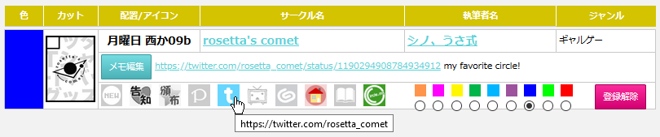
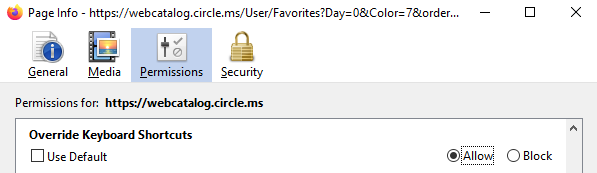

# webcatalog-helper

webcatalog-helper is a simple Chrome/Firefox extension to improve usability of the Comiket Web Catalog (https://webcatalog.circle.ms/).

## Installation

### Chrome

https://chrome.google.com/webstore/detail/webcatalog-helper/epnfnpbamkifbioepdjekjhcjpddajga

### Firefox

TODO

## Features

### Favorites / お気に入り

* Adds the author name (執筆者名) next to the circle name (サークル名)
* Enables clicking anywhere in the memo cell to open the memo text edit field
* Autofocuses the text cursor on the memo text field when opened
* Within the memo text field, adds keyboard shortcuts `Enter` or `Ctrl+S` to save changes or `Esc` to revert changes
* Changes the social media icons to links to their respective social media pages if present, instead of just going to circle info

## Troubleshooting

### Firefox

* In Firefox, the `Ctrl+S` hotkey may open the system Save As window. To disable this, open the [Page Info window](https://support.mozilla.org/en-US/kb/firefox-page-info-window), go to the `Permissions` tab, find the `Override Keyboard Shortcuts` line, and set it to `Allow` .

## Meta

Written by Russell Chou ([@math4origami](https://twitter.com/math4origami)) with help from fc ([@usashiki7](https://twitter.com/usashiki7)). Distributed under the MIT license (see `LICENSE` ). PRs welcome!

## Disclaimer

This extension is distributed on an "AS IS" BASIS, WITHOUT WARRANTIES OR CONDITIONS OF ANY KIND, either express or implied. I am not responsible for any data loss this extension may cause.
